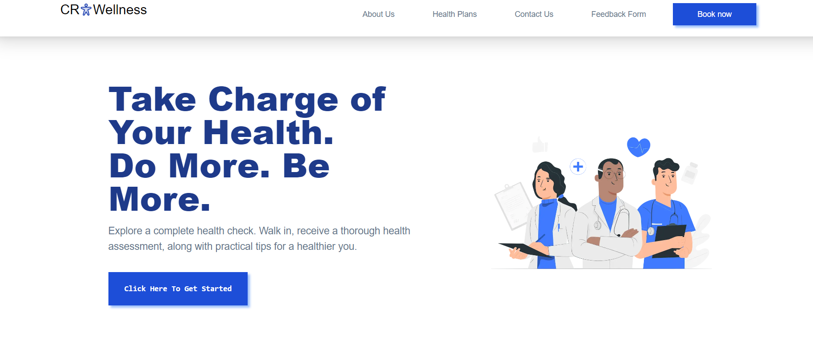

    

# Telemedicine Website

## Table of Contents

  
Table of Contents 

  <ol>
    <li><a href="#about-the-project">About The Project</a>
        <ul>
            <li><a href="#overview">Overview</a></li>
            <li><a href="#key-features">Key Features</a></li>
        </ul>
    </li>
    <li><a href="#built-with">Built With</a></li>
    <li><a href="#getting-started">Getting Started</a></li>
    <li><a href="#available-scripts">Available Scripts</a></li>
  </ol>

## About The Project
A telemedicine website is an online platform that facilitates remote healthcare services. Telemedicine websites gained popularity, offering accessible and convenient healthcare, particularly during events like the COVID-19 pandemic. It's essential for users to choose reputable platforms with qualified healthcare professionals for safe and effective remote medical care.

### Key Features
- Page Navigation: The ability to navigate between pages seamlessly.
- Ability to book a health plan based on your budget.

### Overview

* [Repo Codes](https://github.com/ijayhub/Telemedicine)
* [Hosted Link](https://telemedicine-psi.vercel.app/)

(<a href="#top">back to top</a>)

### Built With
- [Next.js](https://nextjs.org/)
- [Tailwind CSS](https://tailwindcss.com/)
- [TypeScript](https://www.typescriptlang.org/)
- [Fabform](https://fabform.io/)
- [Adobe](https://www.adobe.com/sensei/generative-ai/firefly.html)

(<a href="#top">back to top</a>)

### Getting Started

To get a local copy up and running, follow these simple steps:

### Available Scripts

In the project directory, you can run:

`npm run dev`

Runs the app in the development mode.

Open [http://localhost:3000](http://localhost:3000) to view it in your browser.

The page will reload when you make changes.

You may also see any lint errors in the console.

(<a href="#top">back to top</a>)

